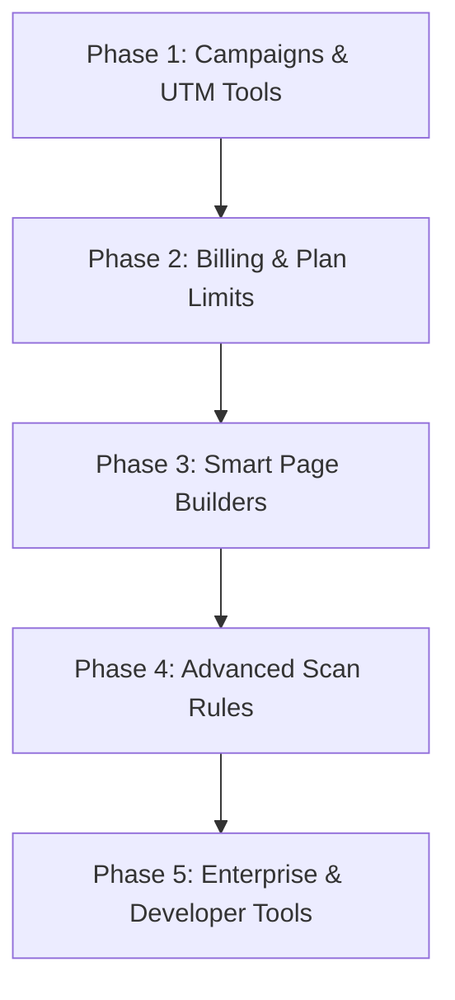

# QR Junction SaaS Transformation Roadmap

This document provides a comprehensive analysis of the current state of **QR Junction**, identifies core gaps preventing it from being a fully commercialized Software-as-a-Service (SaaS) application, and outlines a sequential, step-by-step engineering roadmap to transition it into a premium product.

---

## 1. Technical Audit of Implemented Features

Based on the codebase analysis (Prisma Schema, App Router endpoints, component design, redirection flows), here is what has been built:

| Feature / Module | Implemented Elements | Status / Tech Details |
| :--- | :--- | :--- |
| **Authentication** | Sign in, sign up, session middleware, context provider. | **Fully Functional** (Firebase Auth integrated with PostgreSQL database users via `firebaseUid`) |
| **Dynamic Redirects** | Scan routing `/q/[shortCode]` with UA parsing, cookie checks, database logging, and instant destination updates. | **Fully Functional** (Supports 15 types: URL, Text, WhatsApp, Wifi, Contact, App downloads, Social pages, Email, Phone, SMS) |
| **Analytics Engine** | Real-time collection of clicks, unique scans, geolocation resolution, browser, device, OS, referrer, and UTM parameters. | **Fully Functional** (Vercel edge headers resolution + local testing fallbacks + [ip-api.com](http://ip-api.com) API fallback) |
| **User Dashboard** | Aggregated view of scans, unique metrics, 7-day SVG line trend chart, top locations/cities, device chart, browser/OS list. | **Fully Functional** (Rich responsive dashboard panels feeding off `/api/dashboard/stats`) |
| **Lead Generation / CRM** | Wifi connection landing pages equipped with contact capture forms. Lead database records user details and UTM attribution. | **Functional Foundation** (Leads pipeline supports statuses: `NEW`, `CONTACTED`, etc. and custom admin notes) |

---

## 2. Core Architectural Gaps (Transitioning to SaaS)

While the dynamic QR infrastructure is mature, the following capabilities are currently missing to support a multi-tier SaaS commercial model:

1. **Billing & Subscriptions**: No payment gateway (Stripe/Razorpay), plan schemas, pricing tiers, billing portals, or enforcement middleware (e.g., stopping users from creating QRs if they hit their tier limits).
2. **Campaign Management (UI Layer)**: The database schema supports a `Campaign` relationship, but there is no dashboard interface to create campaigns, group QR codes, or evaluate multi-channel analytics.
3. **Flexible Landing Page Builder**: Currently, only WiFi redirects have a visual client landing page. A SaaS needs a customizable "Link-in-bio" or "Digital Business Card" builder for standard campaigns.
4. **Advanced Routing Options**: Scheduled URL swaps, password-protected redirects, scan caps, expiry dates, and A/B split testing redirection rules are defined in the product document but not implemented in code.
5. **Team Collaboration**: Multi-tenant organizations, roles (Owner, Editor, Viewer), and activity audit logs are missing.
6. **API & Developer Tools**: Access tokens, webhooks (`scan.created`), and bulk generator pipelines are missing.

---

## 3. System Architecture Mapping

The diagram below details how the dynamic redirect request flows through the analytics, database, and redirection layers:

```mermaid
sequenceDiagram
    autonumber
    actor Scanner as User Scan (QR Code)
    participant Edge as Next.js Router (/q/[shortCode])
    participant GeoService as Geo IP Engine (Vercel/ip-api)
    participant Database as PostgreSQL (Prisma Client)
    participant Client as Destination Redirect

    Scanner->>Edge: Hits /q/[shortCode] (Device, IP, Cookies)
    Edge->>Edge: Parse User Agent (OS, Browser, Device Type)
    Edge->>Edge: Inspect "qrj_visitor_id" cookie for uniqueness
    Edge->>GeoService: Resolve IP details
    GeoService-->>Edge: Return Country, City, Coordinates
    
    rect rgb(20, 30, 50)
        Note over Edge, Database: DB Write Operation (Transaction)
        Edge->>Database: Log Scan Registry Row
        Edge->>Database: Increment totalScans & uniqueScans
    end
    
    Database-->>Edge: Return QR Destination Configuration
    
    alt QR Type is WIFI
        Edge-->>Scanner: Render WifiDetailsClient Landing Page (Form Capture)
    else QR Type is TEXT / CONTACT
        Edge-->>Scanner: Serve custom HTML / Trigger contact.vcf download
    else Standard URL / Socials / WhatsApp
        Edge-->>Client: Perform 302 Redirect to Resolved destination
    end
```

---

## 4. Sequential Step-by-Step Implementation Roadmap

To develop this systematically, we recommend implementing features in **5 distinct phases**. Each phase moves the application closer to a proper, launch-ready commercial product.

---

### Phase 1: Campaign Dashboards & UTM Builders (Marketing Tooling)
*Focus: Allow users to group QR Codes into logical marketing campaigns and track group performance.*

1. **Campaign Management UI**:
   - Create a dashboard sub-tab: `/dashboard/campaigns`.
   - Build a card layout to view active campaigns, date ranges, and aggregated metrics (e.g., total scans across all QRs inside the campaign).
   - Create an API route `GET /api/campaigns` and `POST /api/campaigns` linking to the existing `Campaign` database model.
2. **QR Campaign Selection**:
   - Enhance the QR Creation Form (`app/dashboard/qrs/new/page.tsx`) to include a dropdown listing the user's Campaigns.
   - Update the QR creation endpoint to save `campaignId`.
3. **UTM Link Builder Widget**:
   - Create a quick UTM URL builder helper inside the QR generator. When a user pastes a URL, auto-append the chosen UTM fields.
   - Show how the resulting dynamic URL is compiled in real-time.

---

### Phase 2: Billing Infrastructure & Subscription Enforcement (SaaS Core)
*Focus: Enable monetization using Stripe (Global) or Razorpay (India), and enforce plan limits based on subscriptions.*

1. **Pricing Plans System**:
   - Define plans configurations: **Free** (max 10 QRs, 500 scans), **Pro** (unlimited QRs, conversions tracking, custom domains), and **Agency** (teams, custom branding).
   - Create a global billing pricing page: `/pricing` (public) and `/dashboard/billing` (portal).
2. **Stripe/Razorpay Webhooks & Subscriptions Integration**:
   - Introduce a new schema model `Subscription` referencing `User` (storing `stripeCustomerId`, `stripeSubscriptionId`, `planId`, `status`, `currentPeriodEnd`).
   - Create backend endpoints `/api/billing/checkout` to create checkouts, and `/api/billing/webhook` to handle successful invoice payments or cancellations.
3. **Billing Enforcement Middleware**:
   - Create helper checks `checkUserPlanLimits(userId)` to evaluate active QRs and monthly scans.
   - If limits are reached, display a clean pricing upgrade banner and block new QR generation.

---

### Phase 3: Mobile Landing Page Builder & Digital Cards (Content Generation)
*Focus: Enable users to build custom landing pages directly within QR Junction (ideal for social links or restaurants).*

1. **Visual Profile / Smart Page Creator**:
   - Create a mobile-first page builder UI (`/dashboard/pages/new`) where users can add profiles, social links, headers, text, images, and custom styling.
   - Save the layout configuration as a JSON payload in the database.
2. **Landing Page Redirection & Event Capture**:
   - Establish a dynamic page viewer endpoint `/p/[pageId]`.
   - Embed pixel event logs to record button clicks or form inputs as `Conversion` events.
   - Link these dynamic landing pages directly to QR code category types (creating a `LANDING_PAGE` QR type).
3. **Digital Business Cards (vCard Generator)**:
   - Provide a highly polished public profile template for physical business cards where visitors can tap "Save Contact" to directly download the vCard, call, or email.

---

### Phase 4: Advanced Scans, Routing Rules & A/B Testing (Advanced Analytics)
*Focus: Add advanced controls for enterprise campaigns.*

1. **A/B Split Test Redirection**:
   - Update QR configuration to accept multiple destination weights (e.g., 50% URL A, 50% URL B).
   - Update `/q/[shortCode]` routing logic to randomly partition scans based on weights and track conversions per variant to determine the winning landing page.
2. **Scheduled Redirects & Expiring QRs**:
   - Add inputs in the editor for: `expiryDate`, `maxScanLimit`, and `redirectSchedule` (e.g., redirect to *Morning Offer URL* between 6 AM–12 PM, and *Evening Offer URL* after 6 PM).
   - Integrate validation checks inside `/q/[shortCode]` routing to redirect users to a "Link Expired" page if thresholds are crossed.
3. **Scan Security Options**:
   - Implement Password Protection: Require scanners to enter a 4-digit code before being forwarded to sensitive resources.
   - Implement bulk import capabilities (uploading a CSV containing 1,000 URLs to instantly generate a zip folder of custom-themed QRs).

---

### Phase 5: Organizations, API Keys & AI Intelligence Layer (Enterprise Ready)
*Focus: Support larger agencies, team permissions, custom domains, and automated AI analysis reports.*

1. **Organization Accounts & Team Access**:
   - Modify the database schema to introduce `Organization`, `Membership`, and `Role` models.
   - Build a settings page `/dashboard/team` to invite members and assign roles (`Admin`, `Editor`, `Viewer`).
2. **REST API & Developer Integrations**:
   - Add API Key Generation in the dashboard settings.
   - Implement API authentication middleware so developer teams can generate, update, or read scan analytics programmatically.
   - Introduce Webhooks integration allowing users to input target URLs to receive event alerts on `scan.created`.
3. **AI Insights Generator**:
   - Build a dashboard panel feeding data into OpenAI / Gemini APIs to summarize scan trends.
   - Auto-generate monthly PDF marketing reports containing advice like: *"Scans dropped by 15% on Monday; your most active time slot is 6:00 PM. We recommend boosting social sharing during this hour."*
